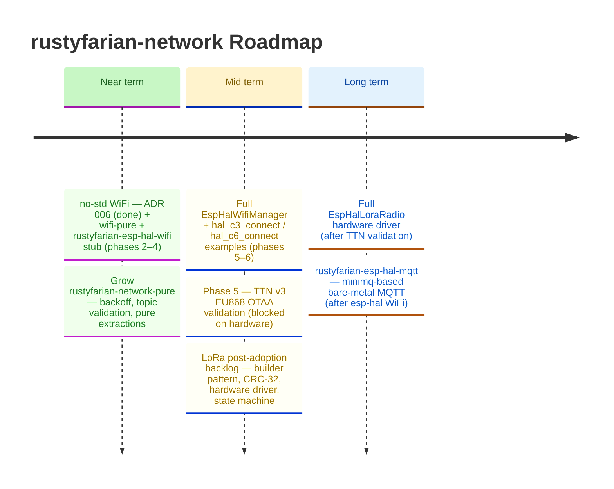

# Roadmap

*Last updated: March 2026*

The LoRa path through Phase 5 (TTN v3 OTAA validation) is blocked on hardware availability.
The immediate near-term focus shifts to the dual-HAL Wi-Fi tier: extracting `wifi-pure`, creating the `rustyfarian-esp-hal-wifi` stub, and building toward a bare-metal `hal_c6_connect` example using `esp-wifi 0.14.0`.
Phase 5 LoRa validation moves to midterm, alongside the LoRa post-adoption backlog.



---

## Near term detail

### no-std / esp-hal WiFi

<details>
<summary><strong>Scoping and implementation plan</strong></summary>

Extends the dual-HAL pattern (ADR 005) from LoRa to Wi-Fi.
Target crate layout:

```
wifi-pure                    — no_std; WiFiConfig, ConnectMode, WifiDriver trait, disconnect reason map
rustyfarian-esp-idf-wifi     — std; esp-idf-svc (existing, refactored to depend on wifi-pure)
rustyfarian-esp-hal-wifi     — no_std; esp-hal + esp-wifi 0.14.0; ESP32-C3/C6 bare-metal
```

**Dependency stack (agent-verified, 2026-03-06)**

- `esp-wifi 0.14.0` — production-ready since Dec 2024; supports ESP32-C3 and ESP32-C6;
  compatible with `esp-hal 1.0.0` (already in workspace); bundles `smoltcp 0.11.0`
- `smoltcp 0.11.0` — `no_std`, `0BSD` licence (**requires adding `"0BSD"` to `deny.toml` allow list**)
- `minimq 0.8.1` — clear winner for a future `rustyfarian-esp-hal-mqtt` crate;
  designed for embedded + smoltcp; maintained by QUARTIQ; MIT OR Apache-2.0
- Rejected: `mqttrust` (abandoned 2023), `rust-mqtt` (unmaintained), `paho-mqtt` (EPL-2.0, requires `std`)

**Extractable types for `wifi-pure`**

| Symbol                                                                   | Currently in                         | Move to                     |
|:-------------------------------------------------------------------------|:-------------------------------------|:----------------------------|
| `WiFiConfig<'a>`                                                         | `rustyfarian-esp-idf-wifi`           | `wifi-pure`                 |
| `ConnectMode`                                                            | `rustyfarian-esp-idf-wifi`           | `wifi-pure`                 |
| `DEFAULT_TIMEOUT_SECS`                                                   | `rustyfarian-esp-idf-wifi`           | `wifi-pure`                 |
| `POLL_INTERVAL_MS`                                                       | `rustyfarian-esp-idf-wifi`           | `wifi-pure`                 |
| `wifi_disconnect_reason_name`                                            | `rustyfarian-esp-idf-wifi` (private) | `wifi-pure` (pub, testable) |
| `SSID_MAX_LEN`, `PASSWORD_MAX_LEN`, `validate_ssid`, `validate_password` | `rustyfarian-network-pure::wifi`     | `wifi-pure`                 |
| `WiFiManager` and all `esp-idf-svc` types                                | `rustyfarian-esp-idf-wifi`           | stays                       |

**`WifiDriver` trait (proposed surface)**

```rust
pub trait WifiDriver {
    type Error: core::fmt::Debug;
    fn configure(&mut self, ssid: &str, password: &str) -> Result<(), Self::Error>;
    fn start(&mut self) -> Result<(), Self::Error>;
    fn connect(&mut self) -> Result<(), Self::Error>;
    fn is_connected(&self) -> Result<bool, Self::Error>;
    fn wait_netif_up(&mut self) -> Result<(), Self::Error>;
}
```

No `get_ip` in the trait — IP address retrieval is ESP-IDF-specific (`sta_netif()`).

**`rustyfarian-esp-hal-wifi` chip features**

| Feature   | Cargo target                   | MCU      |
|:----------|:-------------------------------|:---------|
| `esp32c3` | `riscv32imc-unknown-none-elf`  | ESP32-C3 |
| `esp32c6` | `riscv32imac-unknown-none-elf` | ESP32-C6 |

No default features — stub compiles on host without esp-hal.

**Build pipeline additions**

New `justfile` recipes:
- `check-wifi-pure` — host check for `wifi-pure`
- `check-wifi-hal` — `cargo check -p rustyfarian-esp-hal-wifi --no-default-features`
- `test-wifi` — `cargo test -p wifi-pure --features mock`

New `.cargo/config.toml.dist` blocks:
- `[target.riscv32imc-unknown-none-elf]` — linker `riscv32-esp-elf-gcc`, runner espflash
- `[target.riscv32imac-unknown-none-elf]` — same

**Phased implementation**

1. ~~Author ADR 006 (no-std Wi-Fi dual-HAL decision, modelled on ADR 004/005)~~ — done
2. Create `wifi-pure` skeleton with `WifiDriver` trait and moved types; update `rustyfarian-esp-idf-wifi` with `pub use` re-exports
3. Create `rustyfarian-esp-hal-wifi` stub (compile-only, `EspHalWifiManager` returns errors)
4. Add `check-wifi-pure`, `check-wifi-hal`, `test-wifi` to `justfile`; add bare-metal target blocks to config dist
5. Implement full `EspHalWifiManager` using `esp-wifi 0.14.0` + `smoltcp`
6. Add `hal_c3_connect` and `hal_c6_connect` examples

</details>

---

## Mid term detail

### Phase 5 — TTN v3 EU868 OTAA validation

<details>
<summary><strong>Validation checklist</strong></summary>

The goal is end-to-end OTAA join + first uplink + first downlink with the least moving parts.
All steps use TTN v3 EU868.

**Step 0 — Credentials**

- Create a TTN application and register an end device (LoRaWAN MAC V1.0.3, RP001-1.0.3, OTAA).
- Record DevEUI (8 bytes), JoinEUI/AppEUI (8 bytes), AppKey (16 bytes).
- Decide byte order: TTN displays EUIs as big-endian strings; many stacks expect LSB-first in memory.
  Log DevEUI/JoinEUI as bytes and compare against `lorawan-device` documentation before flashing.
  See `docs/key-insights.md` — "EUI byte order" for the full pitfall description.

**Step 1 — Gateway & RF sanity**

- Confirm a TTN-connected EU868 gateway is online (TTN Console → Gateways → "connected recently").
- Place the device within metres for initial tests; use a correct EU868 antenna.

**Step 2 — SX1262 bring-up (before LoRaWAN)**

- Verify SPI mode 0, 8 MHz; confirm NSS/CS, BUSY, RESET, DIO1 pins.
- Issue a status/sanity command after reset and log the response.
- Confirm BUSY line goes high during operations and returns low; if BUSY is never handled,
  every SPI command stalls — see `docs/key-insights.md` — "BUSY pin".

**Step 3 — TTN Live Data setup**

- Open TTN Console → Application → End Device → Live Data (leave open during testing).
- Enable join-accept and uplink viewing; confirm gateway metadata (RSSI/SNR) is visible.

**Step 4 — OTAA join**

- Firmware must log "joining..." and then either "joined" or the failure reason.
- In Live Data, expect: join-request uplink(s) → join-accept downlink.
- If a join-request is visible but no join-accept: wrong AppKey or EUI byte order mismatch.
- If join-accept is visible in TTN but a device never joins: RX timing or DIO1 IRQ issue
  (see `docs/key-insights.md` — "DIO1 interrupt" and "RX window").
- Tune `RX_WINDOW_OFFSET_MS` if windows are missed; start at -200 ms and adjust upward.

**Step 5 — First uplink**

- After joining, send a small payload (1-8 bytes) on FPort 1.
- TTN Live Data should show the uplink with decoded payload bytes and RSSI/SNR.
- Do not send it before join completes; `LorawanDevice::send()` guards this but the guard
  will need to hold once the real state machine is wired.

**Step 6 — First downlink (port 10 OTA commands)**

- In TTN Console, schedule a downlink: FPort 10, payload `01` (CheckUpdate).
- Trigger an uplink first — downlinks only arrive in RX windows after an uplink.
- Confirm `parse_ota_command()` receives the payload.
- Test additional commands: `05` (ReportVersion), `02 01 02 03` (UpdateAvailable 1.2.3).

**Step 7 — Deep sleep / session persistence (Phase 7 readiness)**

- After join, persist `LorawanSessionData` (CRC-32 check: implement before relying on restore).
- Sleep and wake; confirm TTN accepts subsequent uplinks with incremented `FCntUp`.
- If `FCntUp` is reset or reused, TTN silently rejects the frames — see `docs/key-insights.md` — "Frame counter reuse".

**Common pitfalls quick reference**

| Symptom                                    | Likely cause                                           |
|:-------------------------------------------|:-------------------------------------------------------|
| Join-request visible, no join-accept       | Wrong AppKey or EUI byte order mismatch                |
| Join-accept in TTN, device stays `Joining` | RX window timing off, or DIO1 IRQ not delivered        |
| All SPI commands stall / timeout           | BUSY pin not polled before each command                |
| Downlinks queued but never received        | No uplink to open the RX window; or wrong FPort        |
| Post-sleep uplinks rejected by TTN         | `FCntUp` reset to 0 (session key/counter not restored) |
| Never joins but gateway is nearby          | Wrong frequency plan (US915 vs EU868) or no antenna    |

</details>

### LoRa post-adoption backlog

<details>
<summary><strong>Deferred items from initial adoption</strong></summary>

| # | Item                                                                              |
|--:|:----------------------------------------------------------------------------------|
| 1 | Builder pattern for `LoraConfig` (private fields, `::builder()`)                  |
| 2 | `from_hex_strings` returns `Result` with field-level diagnostics                  |
| 4 | `PartialEq` on `LorawanResponse` / `Downlink`                                     |
| 5 | Replace manual O(n) FIFO shift in `MockLoraRadio::receive` with `heapless::Deque` |
| 6 | Implement CRC-32 integrity check in `restore_from_sleep` (Phase 7)                |
| 7 | Implement `EspLoraRadio` hardware driver (Phase 2-4 milestones)                   |
| 8 | Wire `LorawanDevice::process()` state machine to `lorawan-device 0.12`            |

</details>

---

<details>
<summary><strong>Completed</strong></summary>

### Near-term deliverables (shipped)

- Multi-chip flash + bootloader fix + script arg guards
- `lora-pure` crate
- `rustyfarian-esp-hal-lora` stub
- MQTT Builder API + pure state machine
- `idf_c3_connect` + `idf_c3_mqtt` examples
- `idf_esp32_mqtt` example — MQTT on classic ESP32 (Xtensa)
- `hal_esp32s3_join` example + dual-HAL script infrastructure

### MQTT Enhancements

Driven by [ADR 002](adr/002-mqtt-enhancements-for-downstream-project.md), the `rustyfarian-esp-idf-mqtt` crate was expanded with support for Last Will and Testament, authentication, multi-topic subscription, topic-based callback dispatch, and retained-message publishing.

- `LwtConfig` struct with `new()` constructor for Last Will and Testament support
- `MqttConfig::with_lwt()` builder for attaching an LWT configuration
- `MqttConfig::with_auth()` builder for broker authentication
- Multi-topic subscription: constructor accepts `&[&str]` instead of a single topic
- Topic-based dispatch: callback signature changes from `Fn(&[u8])` to `Fn(&str, &[u8])`
- `MqttManager::publish_with()` for explicit QoS and retain control
- `send_startup_message()` and `send_shutdown_message()` deprecated in favour of `publish_with()`

### Wi-Fi Reliability Fixes

Two issues reported by rustbox-backstage (vault-standalone firmware) were resolved in `rustyfarian-esp-idf-wifi`.

- `WiFiManager::get_ip` now treats transient `is_connected()` and `get_ip_info()` errors as "not ready yet" rather than propagating them; the polling loop continues until the timeout fires, honouring the documented `Ok(Some(ip))` / `Ok(None)` contract
- `ConnectMode` enum replaces the `connection_timeout_secs` field on `WiFiConfig`; timeout only lives inside `Blocking { timeout_secs }`, so it cannot be set in a context where it would have no effect
- `WiFiConfig::connect_nonblocking()` builder sets `NonBlocking` mode; `WiFiManager::new` fires `EspWifi::connect()` and returns immediately, letting the ESP-IDF event loop drive association in the background — see [ADR 003](adr/003-wifi-nonblocking-connect.md)

</details>
