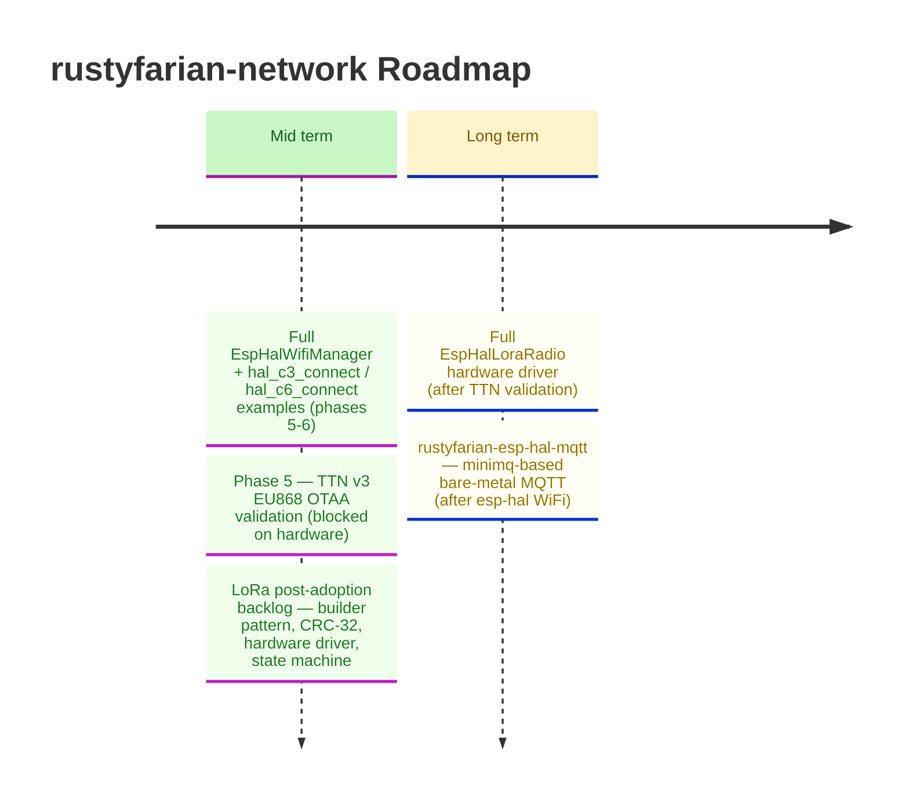

# Roadmap

*Last updated: March 2026*

All near-term work is complete.
Phase 5 LoRa validation remains blocked on hardware; full `EspHalWifiManager` implementation is the next major feature.

---

## Mid term detail

### Full `EspHalWifiManager` implementation

<strong>Remaining phases from the WiFi dual-HAL plan</strong>

Phases 1-4 (ADR 006, `wifi-pure`, `rustyfarian-esp-hal-wifi` stub, justfile recipes) are complete.
The remaining work implements the actual bare-metal Wi-Fi driver.

**Dependency stack (agent-verified, 2026-03-06)**

- `esp-wifi 0.14.0` — production-ready since Dec 2024; supports ESP32-C3 and ESP32-C6;
  compatible with `esp-hal 1.0.0` (already in workspace); bundles `smoltcp 0.11.0`
- `smoltcp 0.11.0` — `no_std`, `0BSD` licence (**requires adding `"0BSD"` to `deny.toml` allow list**)

**`rustyfarian-esp-hal-wifi` chip features**

| Feature   | Cargo target                   | MCU      |
|:----------|:-------------------------------|:---------|
| `esp32c3` | `riscv32imc-unknown-none-elf`  | ESP32-C3 |
| `esp32c6` | `riscv32imac-unknown-none-elf` | ESP32-C6 |

**Remaining phases**

5. Implement full `EspHalWifiManager` using `esp-wifi 0.14.0` + `smoltcp`
6. Add `hal_c3_connect` and `hal_c6_connect` examples

### Phase 5 — TTN v3 EU868 OTAA validation

<strong>Validation checklist</strong>

The goal is end-to-end OTAA join + first uplink + first downlink with the least moving parts.
All steps use TTN v3 EU868.

**Step 0 — Credentials**

- Create a TTN application and register an end device (LoRaWAN MAC V1.0.3, RP001-1.0.3, OTAA).
- Record DevEUI (8 bytes), JoinEUI/AppEUI (8 bytes), AppKey (16 bytes).
- Decide byte order: TTN displays EUIs as big-endian strings; many stacks expect LSB-first in memory.
  Log DevEUI/JoinEUI as bytes and compare against `lorawan-device` documentation before flashing.
  See `docs/key-insights.md` — "EUI byte order" for the full pitfall description.

**Step 1 — Gateway & RF sanity**

- Confirm a TTN-connected EU868 gateway is online (TTN Console → Gateways → "connected recently").
- Place the device within metres for initial tests; use a correct EU868 antenna.

**Step 2 — SX1262 bring-up (before LoRaWAN)**

- Verify SPI mode 0, 8 MHz; confirm NSS/CS, BUSY, RESET, DIO1 pins.
- Issue a status/sanity command after reset and log the response.
- Confirm BUSY line goes high during operations and returns low; if BUSY is never handled,
  every SPI command stalls — see `docs/key-insights.md` — "BUSY pin".

**Step 3 — TTN Live Data setup**

- Open TTN Console → Application → End Device → Live Data (leave open during testing).
- Enable join-accept and uplink viewing; confirm gateway metadata (RSSI/SNR) is visible.

**Step 4 — OTAA join**

- Firmware must log "joining..." and then either "joined" or the failure reason.
- In Live Data, expect: join-request uplink(s) → join-accept downlink.
- If a join-request is visible but no join-accept: wrong AppKey or EUI byte order mismatch.
- If join-accept is visible in TTN but a device never joins: RX timing or DIO1 IRQ issue
  (see `docs/key-insights.md` — "DIO1 interrupt" and "RX window").
- Tune `RX_WINDOW_OFFSET_MS` if windows are missed; start at -200 ms and adjust upward.

**Step 5 — First uplink**

- After joining, send a small payload (1-8 bytes) on FPort 1.
- TTN Live Data should show the uplink with decoded payload bytes and RSSI/SNR.
- Do not send it before join completes; `LorawanDevice::send()` guards this but the guard
  will need to hold once the real state machine is wired.

**Step 6 — First downlink (port 10 OTA commands)**

- In TTN Console, schedule a downlink: FPort 10, payload `01` (CheckUpdate).
- Trigger an uplink first — downlinks only arrive in RX windows after an uplink.
- Confirm `parse_ota_command()` receives the payload.
- Test additional commands: `05` (ReportVersion), `02 01 02 03` (UpdateAvailable 1.2.3).

**Step 7 — Deep sleep / session persistence (Phase 7 readiness)**

- After join, persist `LorawanSessionData` (CRC-32 check: implement before relying on restore).
- Sleep and wake; confirm TTN accepts subsequent uplinks with incremented `FCntUp`.
- If `FCntUp` is reset or reused, TTN silently rejects the frames — see `docs/key-insights.md` — "Frame counter reuse".

**Common pitfalls quick reference**

| Symptom                                    | Likely cause                                           |
|:-------------------------------------------|:-------------------------------------------------------|
| Join-request visible, no join-accept       | Wrong AppKey or EUI byte order mismatch                |
| Join-accept in TTN, device stays `Joining` | RX window timing off, or DIO1 IRQ not delivered        |
| All SPI commands stall / timeout           | BUSY pin not polled before each command                |
| Downlinks queued but never received        | No uplink to open the RX window; or wrong FPort        |
| Post-sleep uplinks rejected by TTN         | `FCntUp` reset to 0 (session key/counter not restored) |
| Never joins but gateway is nearby          | Wrong frequency plan (US915 vs EU868) or no antenna    |

### LoRa post-adoption backlog

<strong>Deferred items from initial adoption</strong>

| # | Item                                                                              |
|--:|:----------------------------------------------------------------------------------|
| 1 | Builder pattern for `LoraConfig` (private fields, `::builder()`)                  |
| 2 | `from_hex_strings` returns `Result` with field-level diagnostics                  |
| 4 | `PartialEq` on `LorawanResponse` / `Downlink`                                     |
| 5 | Replace manual O(n) FIFO shift in `MockLoraRadio::receive` with `heapless::Deque` |
| 6 | Implement CRC-32 integrity check in `restore_from_sleep` (Phase 7)                |
| 7 | Implement `EspLoraRadio` hardware driver (Phase 2-4 milestones)                   |
| 8 | Wire `LorawanDevice::process()` state machine to `lorawan-device 0.12`            |

