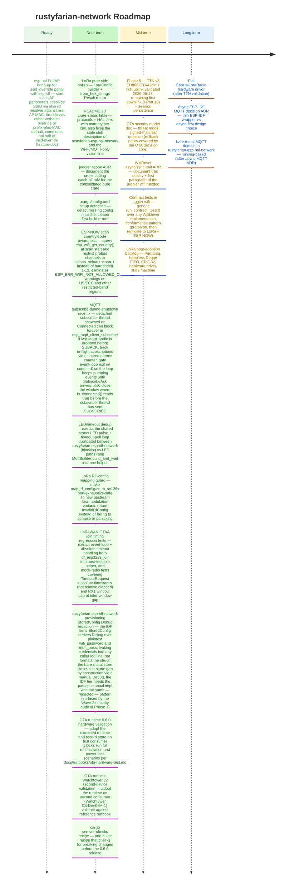

# Roadmap

*Last updated: October 2026*

## Context & recent milestones

Both tiers moved to the September 2026 stack on 2026-09-25.
The bare-metal tier pins `esp-hal 1.2.2` and `esp-radio 1.0.0-beta.1` (pre-release; re-pin to `1.0.0` stable when available).
The IDF tier pins `esp-idf-svc 0.53` and `esp-idf-hal 0.47`.
Hardware validated 2026-09-26: bare-metal C3 STA join, C6 SoftAP provisioning, S3 SX1262 bring-up; provisioning reboot-to-STA not exercised; IDF C3 validated.
Bare-metal Wi-Fi is async-only following `esp-radio 0.18`'s removal of direct `smoltcp` integration.
The TTN OTAA join and first uplink were validated 2026-06-17.
See `docs/features/archive/esp-hal-stack-upgrade-september-2026-v1.md` and `CHANGELOG.md` for API changes.

## Forward plan

```mermaid
%%{init: {
  "theme": "base",
  "themeVariables": {
    "cScale0": "#e8f5e9",
    "cScaleLabel0": "#2e7d32",
    "cScale1": "#c8f7c5",
    "cScaleLabel1": "#1b5e20",
    "cScale2": "#fff3cd",
    "cScaleLabel2": "#7a5a00",
    "cScale3": "#e3f2fd",
    "cScaleLabel3": "#0d47a1"
  }
}}%%

timeline
    title rustyfarian-network Roadmap

    Ready     : esp-hal SoftAP bring-up for ssid_override parity with esp-idf — start takes AP peripherals, resolves SSID via shared resolver against real AP MAC, broadcasts either verbatim override or prefix-plus-MAC default, completes hal half of ssid-override (feature-doc)

    Near term : LoRa pure-side polish — LoraConfig builder + from_hex_strings Result return
              : README 2D crate-status table — protocols × HAL tiers with maturity per cell, also fixes the stale stub description of rustyfarian-esp-hal-network and the Wi-Fi/MQTT-only vision line
              : juggler scope ADR — document the cross-cutting catch-all rule for the consolidated pure crate
              : .cargo/config.toml setup detection — detect missing config in justfile, clearer first-build errors
              : ESP-NOW scan country-code awareness — query esp_wifi_get_country() at scan start and restrict probed channels to schan..schan+nchan-1 instead of hardcoded 1-13, eliminates ESP_ERR_WIFI_NOT_ALLOWED_CHANNEL warnings on US/FCC and other restricted-band regions
              : MQTT subscribe-during-shutdown race fix — detached subscriber thread spawned on Connected can block forever in esp_mqtt_client_subscribe if last MqttHandle is dropped before SUBACK, track in-flight subscriptions via a shared atomic counter, gate event-loop exit on count==0 so the loop keeps pumping events until SubscribeAck arrives, also close the window where is_connected() reads true before the subscriber thread has sent SUBSCRIBE
              : LED/timeout dedup — extract the shared status-LED pulse + timeout-poll loop duplicated between rustyfarian-esp-idf-network (blocking vs LED paths) and MqttBuilder.build_and_wait into one helper
              : LoRa RF-config mapping guard — make map_rf_config/cr_to_sx126x non-exhaustive-safe so new upstream lora-modulation variants return InvalidRfConfig instead of failing to compile or panicking
              : LoRaWAN OTAA join timing regression tests — extract event-loop + absolute timeout handling from idf_esp32s3_join into host-testable helper, add mock-radio tests covering TimeoutRequest absolute timestamp (not relative elapsed) and RX1 window cap at inter-window gap
              : rustyfarian-esp-idf-network provisioning StoredConfig Debug redaction — the IDF tier's StoredConfig derives Debug over plaintext wifi_password and mqtt_pass, leaking credentials into any caller log line that formats the struct, the bare-metal store closes the same gap by construction via a manual Debug, the IDF tier needs the parallel manual impl with the same — redacted — pattern (surfaced by the Wave-3 security audit of Phase 1)
              : OTA runtime 0.6.0 hardware validation — adopt the extracted runtime and record store on first consumer (clock), run full reconciliation and power-loss scenarios per docs/runbooks/ota-hardware-test.md
              : OTA runtime Watchtower v2 second-device validation — adopt the runtime on second consumer (Watchtower C3-DevKitM-1), validate against reference runbook
              : cargo semver-checks recipe — add a just recipe that checks for breaking changes before the 0.6.0 release

    Mid term  : Phase 5 — TTN v3 EU868 OTAA join + first uplink validated 2026-06-17, remaining first downlink (FPort 10) + session persistence
              : OTA security model doc — threat model, signed-manifest question (rollback policy covered by the OTA decision core)
              : WifiDriver async/sync trait ADR — document trait duality + first paragraph of the juggler wifi rustdoc
              : Contract tests in juggler wifi — generic run_contract_tests() over any WifiDriver implementation, conformance pattern (prototype, then replicate to LoRa + ESP-NOW)
              : LoRa post-adoption backlog — PartialEq, heapless Deque FIFO, CRC-32, hardware driver, state machine

    Long term : Full EspHalLoraRadio hardware driver (after TTN validation)
              : Async ESP-IDF MQTT decision ADR — thin ESP-IDF wrapper vs async-first design choice
              : bare-metal MQTT domain in rustyfarian-esp-hal-network — minimq-based (after async MQTT ADR)
```

---

## June 2026 code deep-dive findings

Full review of all 13 crates (~13k lines), the build scripts, and CI.
Overall verdict: the pure-first architecture is consistently executed (thin HAL wrappers, ~208 host tests in the pure layer, minimal and justified unsafe).
The items below are the deltas worth fixing.
Items promoted to the timeline are marked; the rest are small enough to batch into a hygiene session.

|  # | Area                | Finding                                                                                                                                                                                                                                                                                  | Tracked                                                                       |
|---:|:--------------------|:-----------------------------------------------------------------------------------------------------------------------------------------------------------------------------------------------------------------------------------------------------------------------------------------|:------------------------------------------------------------------------------|
|  1 | README              | `rustyfarian-esp-hal-wifi` still described as "stub; full implementation in progress" — it is a working async STA driver, hardware-validated on C3/C6; vision line still says "Wi-Fi and MQTT" though the workspace spans five protocols                                                 | Near term (folded into 2D crate-status table)                                 |
|  3 | esp-idf wifi + mqtt | Status-LED pulse cadence and timeout-poll loop duplicated in three places (`WiFiManager` blocking path, LED path, `MqttBuilder::build_and_wait`)                                                                                                                                         | Near term (LED/timeout dedup)                                                 |
|  4 | esp-idf-lora        | RF-config mapping (`map_rf_config`, SF/BW/CR converters) has no guard for new upstream `lora-modulation` enum variants                                                                                                                                                                   | Near term (mapping guard)                                                     |
|  5 | esp-idf-mqtt        | Currently open: `is_connected()` flips true before the detached subscriber thread has sent SUBSCRIBE — brief window where publishes race ahead of subscriptions (distinct from the resolved SUBACK-deadlock)                                                                             | Near term (folded into subscribe-race fix)                                    |
|  6 | esp-idf-espnow      | `pinned_channel` (`AtomicU8`, sentinel `u8::MAX`) is only updated on successful scans and is never explicitly invalidated on failed scans; failed-scan recovery reuses the last known channel, which is intentional but could become stale if peer/channel reality changes underneath it | Hygiene batch (review whether to keep as-is or add an explicit staleness TTL) |
|  7 | espnow-pure         | `EspNowEvent::new()` panics on oversized payload in debug but silently truncates in release — mode-dependent behaviour                                                                                                                                                                   | Hygiene batch                                                                 |
|  8 | esp-idf-ota         | Cooperative total download deadline now exists (`OtaSession::with_deadline`), complementing the per-read timeout; no user-facing progress callback                                                                                                                                       | Partially resolved (deadline ships in 0.6.0); progress callback deferred      |
|  9 | lora-pure           | `LorawanDevice::process()` returns `NoUpdate` — `PhyRxTx` bridge unwired pending TTN hardware validation (known, documented HIGH RISK)                                                                                                                                                   | Mid term (Phase 5, already tracked)                                           |
| 10 | Pure layer          | Minor style drift: error types vary between `&'static str`, concrete enums, and generic `LorawanError<E>`; acceptable, candidate for the pure-scope ADR to codify                                                                                                                        | Near term (folded into pure-scope ADR)                                        |

Positive findings worth keeping in mind (no action):

- `rustyfarian-esp-hal-network` OTA module's hand-rolled HTTP/1.1 parser is the security high-water mark (33 tests covering RFC 7230 smuggling vectors).
- MQTT's SUBACK-deadlock avoidance (resolved via `MqttBuilder::subscribe`) and its `Weak`-based event-loop shutdown are solid.
- ESP-NOW's failed-scan recovery restores both peer registration and the last-known-good channel (see #6 for the staleness trade-off).

---

## Midterm detail

### Phase 5 — TTN v3 EU868 OTAA validation

<strong>Validation checklist</strong>

The goal is end-to-end OTAA join + first uplink + first downlink with the least moving parts.
All steps use TTN v3 EU868.

**Step 0 — Credentials**

- Create a TTN application and register an end device (LoRaWAN MAC V1.0.3, RP001-1.0.3, OTAA).
- Record DevEUI (8 bytes), JoinEUI/AppEUI (8 bytes), AppKey (16 bytes).
- Decide byte order: TTN displays EUIs as big-endian strings; many stacks expect LSB-first in memory.
  Log DevEUI/JoinEUI as bytes and compare against `lorawan-device` documentation before flashing.
  See `docs/project-lore.md` — "EUI byte order" for the full pitfall description.

**Step 1 — Gateway & RF sanity**

- Confirm a TTN-connected EU868 gateway is online (TTN Console → Gateways → "connected recently").
  For the current Pi 4 + RAK5146 SPI EU868/GPS gateway setup, see the [operational runbook](https://devops.datenkollektiv.de/pages/lorawan-gateway-rak5146-trixie.html).
  A shorter [Trixie gateway write-up](https://devops.datenkollektiv.de/lorawan-gateway-rak5146-trixie.html) is also available.
- Place the device within metres for initial tests; use a correct EU868 antenna.

**Step 2 — SX1262 bring-up (before LoRaWAN)**

- Verify SPI mode 0, 8 MHz; confirm NSS/CS, BUSY, RESET, DIO1 pins.
- Issue a status/sanity command after reset and log the response.
- Confirm BUSY line goes high during operations and returns low; if BUSY is never handled,
  every SPI command stalls — see `docs/project-lore.md` — "BUSY pin".

**Step 3 — TTN Live Data setup**

- Open TTN Console → Application → End Device → Live Data (leave open during testing).
- Enable join-accept and uplink viewing; confirm gateway metadata (RSSI/SNR) is visible.

**Step 4 — OTAA join**

- Firmware must log "joining..." and then either "joined" or the failure reason.
- In Live Data, expect: join-request uplink(s) → join-accept downlink.
- If a join-request is visible but no join-accept: wrong AppKey or EUI byte order mismatch.
- If join-accept is visible in TTN but a device never joins: RX timing or DIO1 IRQ issue
  (see `docs/project-lore.md` — "DIO1 interrupt" and "RX window").
- Tune `RX_WINDOW_OFFSET_MS` if windows are missed; start at -200 ms and adjust upward.

**Step 5 — First uplink**

- After joining, send a small payload (1-8 bytes) on FPort 1.
- TTN Live Data should show the uplink with decoded payload bytes and RSSI/SNR.
- Do not send it before join completes; `LorawanDevice::send()` guards this but the guard
  will need to hold once the real state machine is wired.

**Step 6 — First downlink (port 10 OTA commands)**

- In TTN Console, schedule a downlink: FPort 10, payload `01` (CheckUpdate).
- Trigger an uplink first — downlinks only arrive in RX windows after an uplink.
- Confirm `parse_ota_command()` receives the payload.
- Test additional commands: `05` (ReportVersion), `02 01 02 03` (UpdateAvailable 1.2.3).

**Step 7 — Deep sleep / session persistence (Phase 7 readiness)**

- After join, persist `LorawanSessionData` (CRC-32 check: implement before relying on restore).
- Sleep and wake; confirm TTN accepts subsequent uplinks with incremented `FCntUp`.
- If `FCntUp` is reset or reused, TTN silently rejects the frames — see `docs/project-lore.md` — "Frame counter reuse".

**Common pitfalls quick reference**

| Symptom                                    | Likely cause                                           |
|:-------------------------------------------|:-------------------------------------------------------|
| Join-request visible, no join-accept       | Wrong AppKey or EUI byte order mismatch                |
| Join-accept in TTN, device stays `Joining` | RX window timing off, or DIO1 IRQ not delivered        |
| All SPI commands stall / timeout           | BUSY pin not polled before each command                |
| Downlinks queued but never received        | No uplink to open the RX window; or wrong FPort        |
| Post-sleep uplinks rejected by TTN         | `FCntUp` reset to 0 (session key/counter not restored) |
| Never joins but gateway is nearby          | Wrong frequency plan (US915 vs EU868) or no antenna    |

### Research

| # | Item                                                                                                                       |
|--:|:---------------------------------------------------------------------------------------------------------------------------|
| 1 | Evaluate ESP-IDF v5.5.2 — contains fix for "ESP-NOW send failure when coexistence is enabled"; track for next ESP-IDF bump |

### LoRa post-adoption backlog

<strong>Deferred items from initial adoption</strong>

Items #1 (builder) and #2 (`from_hex_strings` Result) promoted to Near term on 2026-05-06.

| # | Item                                                                              |
|--:|:----------------------------------------------------------------------------------|
| 4 | `PartialEq` on `LorawanResponse` / `Downlink`                                     |
| 5 | Replace manual O(n) FIFO shift in `MockLoraRadio::receive` with `heapless::Deque` |
| 6 | Implement CRC-32 integrity check in `restore_from_sleep` (Phase 7)                |
| 7 | Implement `EspHalLoraRadio` hardware driver (Phase 2-4 milestones)                |
| 8 | Wire `LorawanDevice::process()` state machine to `lorawan-device 0.12`            |

