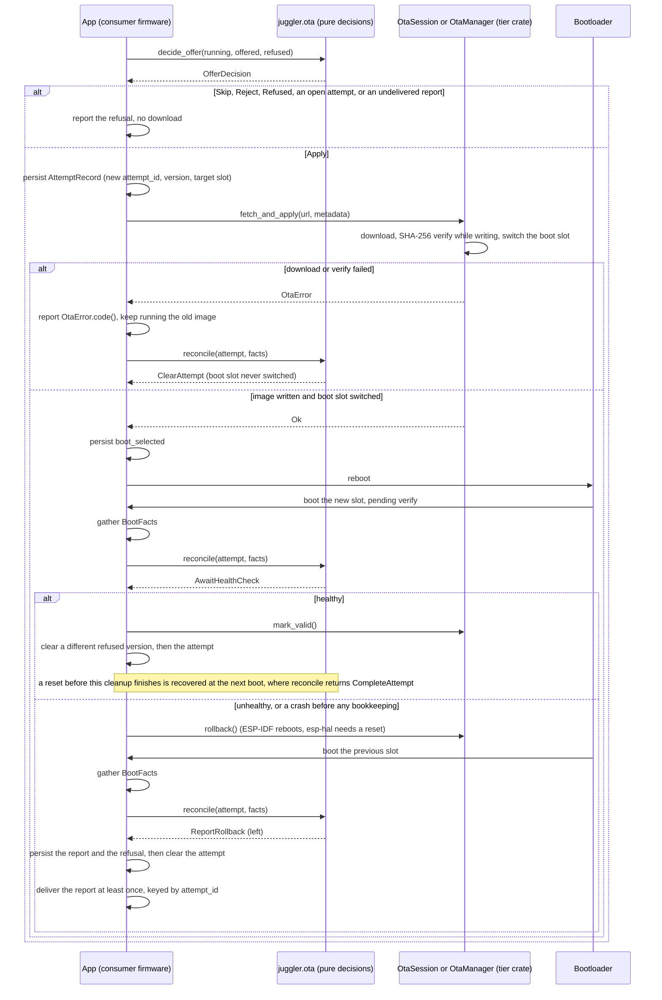
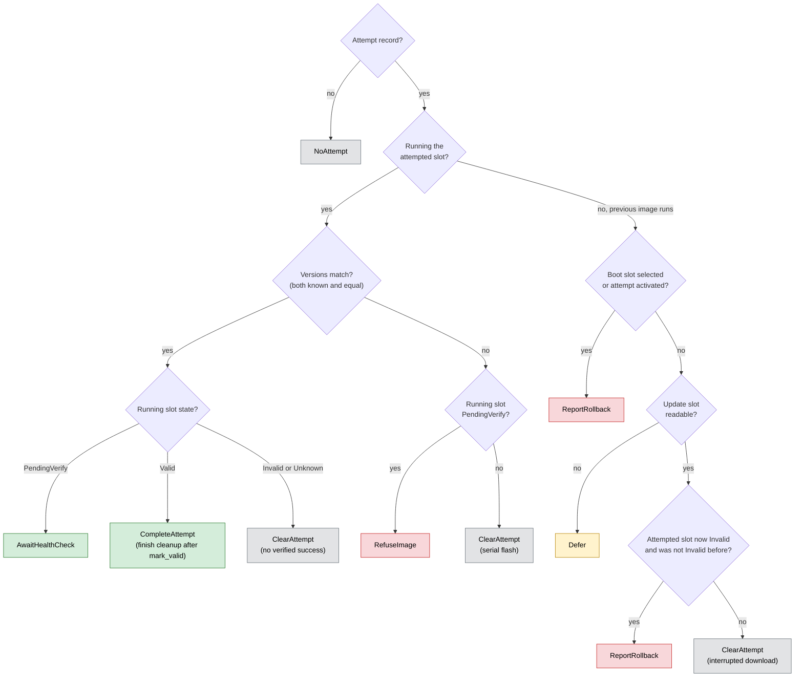
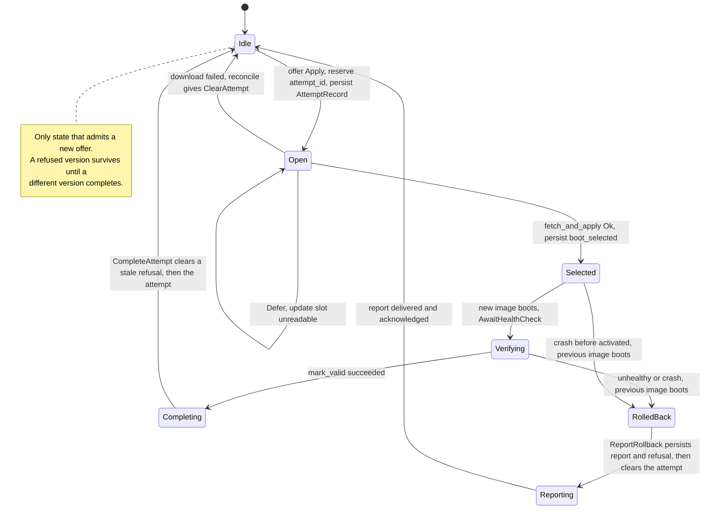

# Feature: OTA Decision Core (refused versions, boot reconciliation, error codes) v1

Requested by `rustyfarian-rgb-clock` after two external reviews of its OTA application layer and a PR review that asked for host-testable decision logic.
The proposal moves three **pure** decisions from that firmware into `juggler::ota`, next to `decide_update`, so both tiers share them and they are unit-tested on the host.
Everything is **additive (semver-minor)**: no existing type or function changes.
Persistence (NVS), the MQTT wire contract and the health policy stay in the consumer.

## How it fits together

This sequence diagram shows a complete A/B firmware update lifecycle, from offer evaluation through successful health verification or a rollback if the new image is unhealthy.



## Problem & evidence

The rgb-clock implements an MQTT-triggered A/B update on `rustyfarian-esp-idf-network` (git `5ed82e6`).
Around `OtaSession`, the application had to grow its own decision logic, which today lives in a binary crate that only builds for the ESP target, so none of it is host-tested:

| Decision                                     | Downstream site (rgb-clock `b0906cb`)                                                | Why it is not app-specific                                                                                                      |
|:---------------------------------------------|:-------------------------------------------------------------------------------------|:--------------------------------------------------------------------------------------------------------------------------------|
| Refuse a version that was rolled back before | `src/ota/mod.rs:728-745` (`previously_rolled_back`), record at `:940-955`            | Without it a redelivered offer loops download → deadline → rollback; any consumer with retained or redelivered commands hits it |
| Reconcile the last update attempt at boot    | `reconcile_boot` `:456`, `reconcile_attempted_image` `:563`, `note_boot_slot` `:375` | Pure A/B bookkeeping over `otadata` slot states, identical for every ESP-IDF device and for the esp-hal tier's `OtaUpdater`     |
| Map `OtaError` to stable status codes        | `reason_for` `:237`                                                                  | Every consumer that reports failures re-invents the same snake_case mapping and can drift                                       |

## Proposed change

### 1. Offer decision with a refused version

`UpdateDecision` is not `#[non_exhaustive]`, so adding a variant would break exhaustive matches; add a sibling instead:

```rust
pub enum OfferDecision {
    Apply,
    Skip,
    Reject,
    Refused,
}

pub fn decide_offer(running: Version, offered: Version, refused: Option<Version>) -> OfferDecision;
```

`Refused` wins only when `offered` would otherwise be `Apply` and equals `refused`; `Skip` and `Reject` keep their meaning.
The consumer persists `refused` (set when a rollback leaves a version, kept until a different version passes the health check after `mark_valid`); v1 keeps a single refused version.

### 2. Boot reconciliation as a pure function

Inputs the consumer gathers at boot, outputs it executes:

```rust
pub struct AttemptRecord {
    pub attempt_id: u32,
    pub version: Option<Version>,
    pub slot: SlotId,
    pub boot_selected: bool,
    pub activated: bool,
    pub slot_was_invalid: bool,
}

pub enum SlotState {
    Valid,
    PendingVerify,
    Invalid,
    Unknown,
}

pub struct BootFacts {
    pub running_slot: SlotId,
    pub running_state: SlotState,
    pub running_version: Option<Version>,
    pub update_slot: Option<(SlotId, SlotState)>,
    pub report_persisted: bool,
}

pub struct SlotId(pub u8);

pub enum ReconcileAction {
    NoAttempt,
    AwaitHealthCheck { mark_activated: bool },
    ClearAttempt,
    CompleteAttempt,
    RefuseImage { promised: Option<Version>, mark_activated: bool },
    ReportRollback { attempt_id: u32, left: Option<Version>, report_already_persisted: bool },
    Defer,
}

pub fn reconcile(attempt: Option<&AttemptRecord>, facts: &BootFacts) -> ReconcileAction;
```

The decision tree of `reconcile`, read top to bottom; red actions report or refuse, green awaits or completes a successful update, yellow defers, grey clears the attempt.



The base rules are the ones the rgb-clock validated on hardware (feature doc `docs/features/ota-mvp-v1.md` there, validation items 4-9).
The review-driven additions (`boot_selected`, `Defer`, `attempt_id`, `CompleteAttempt`, the admission rules) are covered by the host lifecycle simulation only and are not yet hardware-validated:

- no attempt: [`ReconcileAction::NoAttempt`].
- the attempted slot is running (`running_slot == attempt.slot`, versions match only if both are `Some` and equal):
  - match and `running_state == PendingVerify`: [`ReconcileAction::AwaitHealthCheck`]; mark the attempt activated if it is not yet.
  - match and `running_state == Valid`: [`ReconcileAction::CompleteAttempt`]; successful update whose cleanup may have been interrupted.
  - match and (`running_state == Invalid` or `running_state == Unknown`): [`ReconcileAction::ClearAttempt`]; no health verification passed, so not evidence of a healthy different version.
  - mismatch and `running_state == PendingVerify`: [`ReconcileAction::RefuseImage`]; never mark valid, roll back; refusal marks the attempt activated to ensure a slot already `Invalid` is not confused with an interrupted download on the next boot.
  - mismatch and any state other than `PendingVerify`: [`ReconcileAction::ClearAttempt`]; serial flash over the slot, not an OTA image.
- otherwise the previous image runs (`running_slot != attempt.slot`):
  - `activated || boot_selected`: [`ReconcileAction::ReportRollback`]; the image was activated or selected for boot and then rolled back.
  - else `update_slot == None`: [`ReconcileAction::Defer`]; keep all records and retry at runtime with refreshed facts or at the next boot.
  - else `update_slot == Some((attempt.slot, Invalid))` and `!slot_was_invalid`: [`ReconcileAction::ReportRollback`]; fallback for the window between the internal boot-slot switch and persisting `boot_selected`.
  - else: [`ReconcileAction::ClearAttempt`]; the download was interrupted before the boot slot was switched.
`boot_selected` is persisted right after `fetch_and_apply` returns `Ok`, before reboot; never before the call.

`PendingVerify` is the only slot state treated as awaiting verification; `Valid`, `Invalid`, and `Unknown` are all treated as "not pending".
`SlotId` is a small `Copy` type (slot index), so the function stays `no_std` and allocation-free; the consumer maps partition labels.
`Unknown` covers `embedded-svc`'s `Factory` and `Unknown`.

### 2.1 Action semantics and persistence order

The persisted records move through this lifecycle; a new offer is admitted only in `Idle`.



#### Per action

- **NoAttempt:** no attempt record exists; boot normally.
- **AwaitHealthCheck:** the attempted image is running and awaits verification. Persist `activated = true` if `mark_activated` is set, then run the health policy. After `mark_valid()` succeeds, clear a refused version that differs from the running one, then clear the attempt (same cleanup as `CompleteAttempt`). A reset or failed write in between is recovered by the next boot's `CompleteAttempt`.
- **CompleteAttempt:** the attempted image is running, matches the manifest, and is `Valid`; the update succeeded but cleanup may be unfinished. Clear a refused version that differs from the running one, then clear the attempt. If the refusal clear fails, keep the attempt (retried at runtime or next boot).
- **ClearAttempt:** the attempt did not produce evidence of a healthy different version. Never clears a refused version; used when the slot never booted, or booted but never passed health checks, or the download was interrupted before the boot slot was switched.
- **RefuseImage:** the attempted image is running but versions do not match. Persist the activation mark (if `mark_activated`), even if that write fails. Persist the rollback request; never mark valid; roll back; keep the attempt.
- **ReportRollback:** the previous image runs and the attempted image was activated or selected for boot before rolling back. Persist the rollback report (unless `report_already_persisted`), then persist the refused version (if `left` is `Some`). Do not treat as best-effort; if either write fails keep the attempt; clear the attempt only after both writes are durable.
- **Defer:** keep all records and retry at runtime with refreshed facts (re-read the update slot) or at the next boot. No persistence action required.

#### Attempt identity

`attempt_id` is a consumer-assigned, strictly increasing counter persisted with each attempt record.
The backend deduplication key is the tuple `(device identity, attempt_id)`.
Skipped ids are harmless (gaps in the sequence), but reused ids can suppress a real report.
The counter survives the attempt deletion and must be reserved durably **before** the update starts: write the next counter value in separate durable storage first, then write the attempt record.
This order ensures the counter always advances and is never shadowed by a failed attempt write.
Factory reset and counter exhaustion require a consumer identity and reset policy (e.g., a per-install epoch alongside the id).

#### Reporting

`report_persisted` is an armed (persisted) report state, not a request; read it after confirming any pending rollback request, and fail-safe if the read fails (do not call `reconcile`).
The report belongs to the current attempt only; correlate by `attempt_id`.
Delivery is at-least-once: the report carries `attempt_id` as a stable event id for backend deduplication.
v1 maintains a single report record: admission is blocked while an undelivered report exists, in addition to while an attempt record exists (a second failed update while reporting is offline cannot overwrite the first report).

#### Refusal lifetime and admission

A refused version is kept until a DIFFERENT version passes the health check (after `mark_valid`), not cleared on acceptance or download; v1 keeps a single refused version (explicitly limited history).
While any attempt record exists, no new offer is accepted (`Defer`, `AwaitHealthCheck`, `RefuseImage`, or `ReportRollback` with failed writes).

#### Runtime retry

While the healthy previous image runs, the consumer may re-run reconciliation at runtime with refreshed facts (`BootFacts`), bounded (e.g. with `ExponentialBackoff`); scheduling stays in the consumer.
Safe to repeat: `ReportRollback` steps (idempotent via `report_persisted`/`attempt_id`), the refusal write, `ClearAttempt`, `CompleteAttempt`, `Defer` (re-read the update slot).
Not safe to repeat: `AwaitHealthCheck` (owned by the health policy), `RefuseImage` (ends in a reboot).

#### Read errors

On any read error on NVS records (e.g. `running_version`, `running_slot`, or `report_persisted`): leave records in place, refuse to mark valid, and do not call `reconcile` with guessed facts.
The next boot's reconciliation will retry with fresh facts.
`update_slot` read failures are not fatal; pass `None` if the read fails.
A version string that fails to parse is expressed as `None` in `AttemptRecord::version` / `BootFacts::running_version` (always treated as a mismatch).

#### Tier rollback difference

IDF `OtaSession::rollback()` reboots on success; HAL `OtaManager::rollback()` returns `Ok` and the caller must reset.
If rollback fails, never mark valid; the health deadline or next reset retries.

#### Download failure

If `fetch_and_apply` returns `Err`, call `reconcile` immediately with refreshed facts instead of waiting for a reboot: the previous image still runs and the boot slot was not switched, so it returns `ClearAttempt` and admission reopens.

`boot_selected` is persisted right after `fetch_and_apply` returns `Ok`, before reboot; never before the call.

### 2.2 Mapping notes

The esp-idf-svc library folds `NEW` + `PENDING_VERIFY` into `Unverified` (map to `SlotState::PendingVerify`) and `INVALID` + `ABORTED` into `Invalid`.
The `SlotId` label-to-index mapping must be one-to-one; unmappable labels (e.g. factory slots) are read errors, not `None`.
With bootloader app-rollback disabled in the firmware config, nothing is ever `PendingVerify`; a booted attempt yields `ClearAttempt`.
`Unknown` is conclusive for esp-idf-svc 0.53's mapping of known IDF states: `ESP_ERR_NOT_FOUND` (no otadata record — never selected for boot, or otadata erased by serial flash) and `ESP_OTA_IMG_UNDEFINED` (app rollback disabled — no verification, a booted image is final) map to `Unknown`; a failed read is a read error, not `Unknown`; `Defer` on `Unknown` would wedge rollback-disabled devices.
The wrapper's catch-all also maps unrecognised state values (otadata corruption, future IDF states) to `Unknown`, a residual risk; consumers reading raw IDF states should map unrecognised values to a read error.

#### Known limitations

- Power loss after the library switches the boot slot but before `boot_selected` is persisted, followed by a new image that crashes before `activated`, into an already-Invalid slot, reads as an interrupted download (`ClearAttempt`). Cost is bounded: at most one extra download per such coincident power failure, assuming the subsequent `boot_selected` persistence succeeds; repeated power losses or storage failures can cause repeated retries. The retry's own `boot_selected` write catches it. Closing it would need either `Defer` on a case indistinguishable from an ordinary interrupted download (permanent blocked attempt) or the otadata sequence number, which esp-idf-svc and the public esp_ota API do not expose.
- A serial flash erasing otadata after `boot_selected` was persisted reads as a rollback.
- With bootloader app-rollback disabled, a booted attempt reads `Unknown` and never reaches `CompleteAttempt`, so a refusal recorded before rollback was disabled does not clear through this path; refusals only arise from rollbacks, which need rollback enabled.

### 3. Stable codes for `OtaError`

```rust
impl OtaError {
    pub const fn code(&self) -> &'static str;
}
```

Returns stable, machine-readable error codes as a wire contract for status reporting to backends.
Report the HTTP status (`DownloadFailed.status`) and operation context alongside the code when available.

|       Error variant | code()                | Meaning                                       |
|--------------------:|:----------------------|:----------------------------------------------|
| `ServerUnreachable` | `server_unreachable`  | Update server could not be reached            |
|    `DownloadFailed` | `download_failed`     | Non-200 HTTP status or protocol rejection     |
|   `DownloadTimeout` | `download_timeout`    | Download did not complete within allowed time |
|  `ChecksumMismatch` | `checksum_mismatch`   | SHA-256 digest does not match expected value  |
|    `VersionInvalid` | `version_invalid`     | Version string failed to parse                |
|  `FlashWriteFailed` | `flash_write_failed`  | Writing to flash failed                       |
| `PartitionNotFound` | `partition_not_found` | OTA partition could not be located            |
| `InsufficientSpace` | `insufficient_space`  | Not enough flash space for the new image      |

## Decisions

<details><summary><strong>Decision table</strong></summary>

|                                                    Decision | Reason                                                                                                                                                  | Rejected Alternative                                                                                           |
|------------------------------------------------------------:|:--------------------------------------------------------------------------------------------------------------------------------------------------------|:---------------------------------------------------------------------------------------------------------------|
|                   Pure decisions in `juggler::ota`, not I/O | Host-testable and shared by both tiers, matching ADR 011's `*-pure` split                                                                               | A shared NVS record store (deferred; tier-specific storage)                                                    |
|                      New `decide_offer` and `OfferDecision` | Purely additive; `UpdateDecision` is exhaustive                                                                                                         | A `Refused` variant on `UpdateDecision` (breaking)                                                             |
|            `reconcile` returns an action, never performs it | Consumers keep their persistence order and fail-safe on read errors                                                                                     | A trait over the record store (couples storage into juggler)                                                   |
| MQTT command parsing and health policy stay in the consumer | App-specific contract; the esp-hal tier has no MQTT (ADR 015)                                                                                           | A shared `ota/command` schema                                                                                  |
|                      `RefuseImage` carries `mark_activated` | Keeps the next boot's rollback detection correct when the target slot was already `Invalid`                                                             | Rely on the target slot turning `Invalid` (fails when `slot_was_invalid`)                                      |
|            `update_slot` is optional, plus a `Defer` action | rgb-clock reads the update slot only when the previous image runs; a mandatory read would roll back a healthy pending update on a transient error       | Mandatory update-slot facts                                                                                    |
|                              Versions are `Option<Version>` | rgb-clock treats an unparseable running or promised version as a mismatch; a sentinel version would be persisted as the refused version                 | Sentinel `Version` chosen by the consumer                                                                      |
|                         `boot_selected` as durable evidence | After any rollback the inactive slot is already `Invalid`, so slot state cannot distinguish a crashed new image from an interrupted download            | Defer whenever ambiguous (leaves a permanent attempt after every interrupted download into a rolled-back slot) |
|           Window after the boot-slot switch accepted for v1 | Bounded cost (one extra download, assuming subsequent persistence succeeds); alternatives block updates permanently or need unexposed otadata internals | Defer the ambiguous case                                                                                       |
|              `CompleteAttempt` separate from `ClearAttempt` | A reset after `mark_valid` must still clear a stale refusal, while abandoned attempts must never clear one                                              | Reuse `ClearAttempt` (left a higher refused version blocked forever)                                           |
|                                    `attempt_id` as event id | Version + slot does not identify repeated attempts; enables at-least-once delivery with backend dedup                                                   | Dedup by version + slot                                                                                        |
|             Admission blocked while a report is undelivered | One report record cannot hold a backlog                                                                                                                 | Durable report queue (deferred)                                                                                |
|                                  `Unknown` stays conclusive | It means no otadata record or rollback disabled, never a failed read                                                                                    | Defer on `Unknown` (wedges rollback-disabled devices)                                                          |

</details>

## Constraints

- `no_std`, no allocation, behind the existing `ota` feature.
- Additive only; `decide_update`, `UpdateDecision` and `OtaError` keep their current shape.
- Both tiers can call the same functions; slot states map from `esp-idf-svc`'s `SlotState` and from `esp-bootloader-esp-idf`.
- New types (`SlotId`, `SlotState`, `AttemptRecord`, `BootFacts`, `OfferDecision`, `ReconcileAction`) are re-exported from both `rustyfarian-esp-idf-network::ota` and `rustyfarian-esp-hal-network::ota` (parity guard in hal `ota/mod.rs`).

## Open Questions

- [x] `SlotId` as a slot index or as a bounded label (`heapless::String<16>`)?
  `SlotId(pub u8)` — the consumer maps partition labels to indices.
- [x] Should `ReconcileAction` carry the rollback reason (`bootloader`), or is that the consumer's naming?
  Rollback reason stays the consumer's naming; the decision only reports that a rollback occurred.
- [x] esp-idf-svc folds `ABORTED` and `INVALID` into `SlotState::Invalid` (`esp-idf-svc 0.53 src/ota.rs:643`); does `SlotState` need to distinguish them for the esp-hal tier?
  `SlotState` keeps a single `Invalid` variant; no decision distinguishes them.

## Validation

A host lifecycle simulation (`crates/juggler/tests/ota_lifecycle.rs`) injects crashes and failed writes at every decision step; the simulation includes a scenario where the refused version is higher than the successful update, and interrupts each completion-cleanup step (refusal clear, then attempt clear) separately.
The simulation now also splits send from ack, models an offline reporting channel, runtime retries with backoff, and asserts refusal immediately after the first rollback, with the boot-slot-switch window classified separately; hardware recovery is not yet revalidated.

## State

- [x] Design approved
- [x] Core implementation
- [x] Tests passing
- [x] Documentation updated

## Session Log

<details><summary><strong>Session log</strong></summary>

- 2026-10-04 — Feature doc created from the `rustyfarian-rgb-clock` request (OTA application layer PR review).
- 2026-10-04 — Design reviewed against rgb-clock `b0906cb`; open questions resolved; `RefuseImage` gains `mark_activated`; implementation started.
- 2026-10-04 — Implemented; verified by code review, an exhaustive oracle (13,824 cases, 0 mismatches) and an equivalence check against rgb-clock; refinement: optional update slot, `Defer`, optional versions.
- 2026-10-04 — Added lifecycle sequence diagram and reconcile decision flowchart; rules list aligned with code (explicit running_slot, activated, slot_was_invalid conditions); OtaError.code() reference table added.
- 2026-10-04 — External review: added `boot_selected`, made refusal persistence mandatory, defined refusal lifetime and admission, renamed report dedup fields, documented `Unknown` and tier rollback differences; lifecycle crash-injection test added.
- 2026-10-04 — Second external review: `attempt_id` event id, at-least-once delivery, admission blocked while a report is undelivered, bounded runtime retry, boot-slot-switch window documented as a v1 limitation, `Unknown` qualified.
- 2026-10-04 — Clarified after a PR review: the exhaustive oracle was a one-off check outside the repository (`tmp/`, not committed); the committed coverage is the unit tests plus `crates/juggler/tests/ota_lifecycle.rs`.
- 2026-10-04 — Third review: `CompleteAttempt` fixes interrupted success cleanup leaving a stale refusal; attempt-id scope and persistence order documented; boot-slot window limitation qualified.
- 2026-10-04 — Documentation pass: record-lifecycle state diagram, download-failure and CompleteAttempt recovery paths in the sequence diagram, section 2.1 consolidated.

</details>
